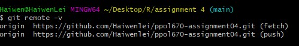

```{r setup, include=FALSE}
knitr::opts_chunk$set(warning = FALSE)
knitr::opts_chunk$set(message = FALSE)
```
```{r include = FALSE}
def.chunk.hook  <- knitr::knit_hooks$get("chunk")
knitr::knit_hooks$set(chunk = function(x, options) {
  x <- def.chunk.hook(x, options)
  ifelse(options$size != "normalsize", paste0("\n \\", options$size,"\n\n", x, "\n\n \\normalsize"), x)
})

```

### source of data 
[IPUMS CPS](https://cps.ipums.org/cps/)


### SSH screenshot 



```{r}
#loading packages and data 
library(ggplot2)
library (tidyverse)
library(ipumsr)
ddi <- read_ipums_ddi("data/cps_00002.xml")
data <- read_ipums_micro(ddi)

```

## Graph 1 
```{r}
library(ggplot2)
data %>% 
  filter(COVIDUNAW != 99) %>%
  mutate(ubwcvd = if_else(COVIDUNAW == 1, "No" ,"Yes")) %>%
  ggplot(mapping= aes(x = ubwcvd)) + 
  geom_bar() +
  geom_text(stat='count', aes(label=(..count..)), vjust=-0.5, size = 3) + 
  facet_wrap(~YEAR) +
  labs(title = "The number of people unable to work due to COVID by year" ,
       subtitle = "Bar chart counting on number of people",
       caption = "Data source:IPUMS CPS"
  )+ 
  ylab("Number of people in thousands")+
  xlab("Unable to work due to COVID") + 
  scale_y_continuous(labels = function(y)y/ 1000,
                     breaks = seq(0, 1250000,250000),
                     limits= c(0,1250000))
  
  
#The first graph informs the number of people who are unable to work due to COVID from 2020 to 2022 February. The respondents reported yes if they are unable to work during the previous four weeks because their employer shut down or lost business due to the pandemic. The bar chart tells that more respondents reported being unable to work in 2020 compared to 2021. In 2021, more people reported that Covid is not deferring them from working. This graph informs policies related to retaining workforce in the pandemic and how much does covid stop people from working.    


```
## Grpah 2
```{r}


```


## R Markdown

This is an R Markdown document. Markdown is a simple formatting syntax for authoring HTML, PDF, and MS Word documents. For more details on using R Markdown see <http://rmarkdown.rstudio.com>.

When you click the **Knit** button a document will be generated that includes both content as well as the output of any embedded R code chunks within the document. You can embed an R code chunk like this:

```{r cars}
summary(cars)
```

## Including Plots

You can also embed plots, for example:

```{r pressure, echo=FALSE}
plot(pressure)
```

Note that the `echo = FALSE` parameter was added to the code chunk to prevent printing of the R code that generated the plot.
